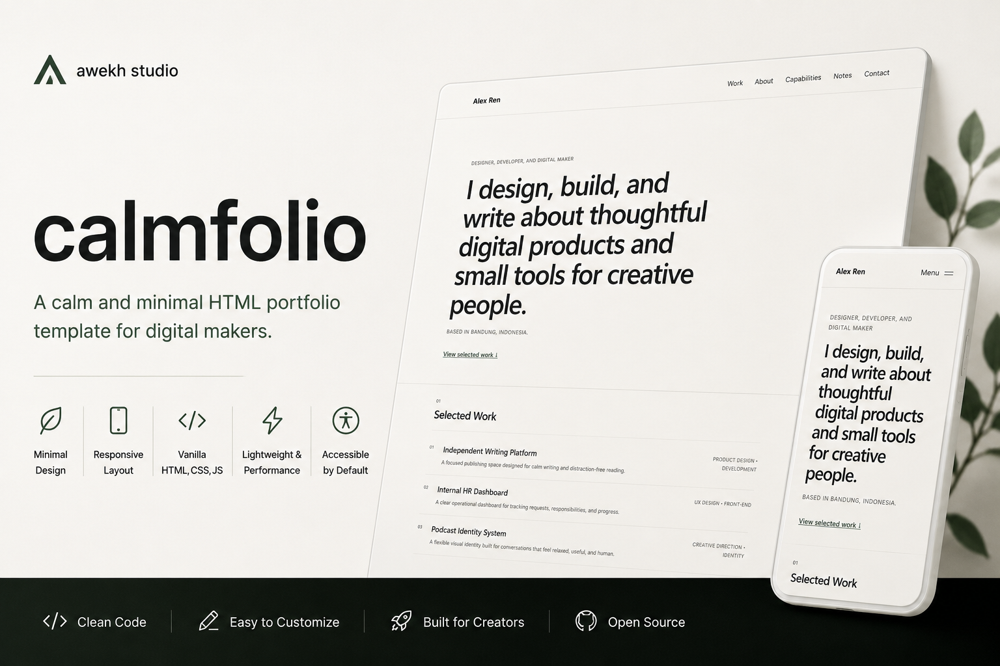

# Calmfolio

> A calm and minimal HTML portfolio template for digital makers.



## Live demo

[View the Calmfolio demo](https://awekhstudio.github.io/calmfolio/)

> The demo URL is ready for GitHub Pages and will work after Pages is enabled for the repository.

## About

Calmfolio is a quiet, responsive one-page portfolio for developers, designers, writers, content creators, podcasters, and other digital makers. It is the first open-source template from **awekh studio** and is intentionally easy to understand, customize, and publish.

## Features

- Semantic single-page HTML structure
- Mobile-first responsive layout
- Accessible mobile navigation with progressive enhancement
- Selected work, about, capabilities, notes, and contact sections
- Clear keyboard focus states
- Reduced-motion support
- Lightweight hover and interaction states
- No framework, dependencies, package manager, or build step

## Tech stack

- HTML5
- CSS
- Vanilla JavaScript

## Getting started

### Download ZIP

1. Download the repository as a ZIP from GitHub.
2. Extract the archive.
3. Open `index.html` in your browser.

### Clone with Git

```sh
git clone https://github.com/awekhstudio/calmfolio.git
cd calmfolio
```

Then open `index.html` in your browser. Calmfolio does not need installation, npm, a local server, or a build process.

## Project structure

```text
calmfolio/
├── .github/
│   ├── ISSUE_TEMPLATE/
│   │   ├── bug_report.md
│   │   └── feature_request.md
│   └── pull_request_template.md
├── assets/
│   ├── css/
│   │   ├── reset.css
│   │   └── style.css
│   ├── icons/
│   │   └── favicon.svg
│   ├── images/
│   │   ├── profile/
│   │   └── projects/
│   └── js/
│       └── main.js
├── preview/
│   ├── calmfolio-cover.jpg
│   ├── calmfolio-desktop.jpg
│   └── calmfolio-mobile.jpg
├── .editorconfig
├── .gitignore
├── 404.html
├── CHANGELOG.md
├── CONTRIBUTING.md
├── LICENSE
├── README.md
├── SECURITY.md
├── index.html
├── robots.txt
└── sitemap.xml
```

## Customization

### Content

Edit `index.html` to replace:

- **Name:** the `.site-name`, page title, metadata, and footer copyright
- **Headline:** the `<h1>` inside `#home`
- **Location:** `.hero-meta`
- **Projects:** the articles inside `.work-list`
- **About:** the paragraphs inside `#about`
- **Capabilities:** the list inside `.capabilities-list`
- **Notes:** the articles inside `.notes-grid`
- **Contact links:** the links inside `.contact-links`

Search for `Alex Ren`, `example.com`, and `username` to find the main demo placeholders quickly.

### Visual tokens

Edit the custom properties at the top of `assets/css/style.css`:

- **Colors:** `--background`, `--surface`, `--text-primary`, `--text-secondary`, `--border`, and `--accent`
- **Spacing:** `--space`
- **Container width:** `--container-width`
- **Corner radius:** `--radius`

Keep sufficient contrast when changing colors and test the result at mobile and desktop sizes.

### Metadata and preview assets

Update the metadata in the `<head>` of `index.html`. Comments identify the canonical URL, public preview URL, cover image, and favicon that should be changed for a personal deployment.

The images in `preview/` are release placeholders. Replace them while keeping these filenames:

- `calmfolio-desktop.jpg` — suggested desktop screenshot
- `calmfolio-mobile.jpg` — suggested mobile screenshot
- `calmfolio-cover.jpg` — suggested 1200 × 630 px social and README cover

## Deployment

All project paths are relative, so Calmfolio works from a domain root, the GitHub Pages `/calmfolio/` subfolder, or directly from `index.html`.

### GitHub Pages

1. Push the repository to `https://github.com/awekhstudio/calmfolio`.
2. On GitHub, open **Settings → Pages**.
3. Under **Build and deployment**, choose **Deploy from a branch**.
4. Select the `main` branch and the `/ (root)` folder, then save.
5. The site will be available at `https://awekhstudio.github.io/calmfolio/`.

No workflow file or build command is required.

### Netlify

Import the Git repository or drag the project folder into Netlify Drop. Leave the build command empty and use the repository root as the publish directory.

### Cloudflare Pages

Connect the Git repository, choose no framework preset, leave the build command empty, and use the repository root as the output directory.

### Shared hosting

Upload the contents of the repository to the public web directory using your hosting control panel or FTP. Make sure `index.html` remains beside `assets/`.

After choosing a different public URL, update the canonical URL, Open Graph URL, preview image URLs in `index.html`, and the location in `sitemap.xml`.

## Accessibility

Calmfolio includes semantic landmarks, a skip link, logical heading hierarchy, visible keyboard focus states, accessible navigation labels, progressive enhancement, and support for `prefers-reduced-motion`. Custom content and color changes should be reviewed for meaningful link text, heading order, image alternatives, and sufficient contrast.

## Browser support

Calmfolio targets current versions of Chrome, Edge, Firefox, and Safari. It uses standard HTML, CSS, and JavaScript and remains readable when JavaScript is disabled. Older browsers may not reproduce every spacing or sizing detail.

## Roadmap

- Replace release preview placeholders with final screenshots
- Gather feedback from the first public release
- Refine documentation and examples without adding unnecessary complexity

Major features and new dependencies are not planned without prior discussion.

## Contributing

Small, focused improvements are welcome. Read [CONTRIBUTING.md](CONTRIBUTING.md) before opening an issue or pull request.

## License

Calmfolio is available under the [MIT License](LICENSE).

## Credits

Designed and maintained by [awekh studio](https://github.com/awekhstudio).
